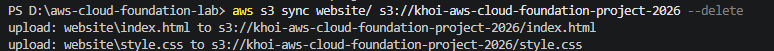
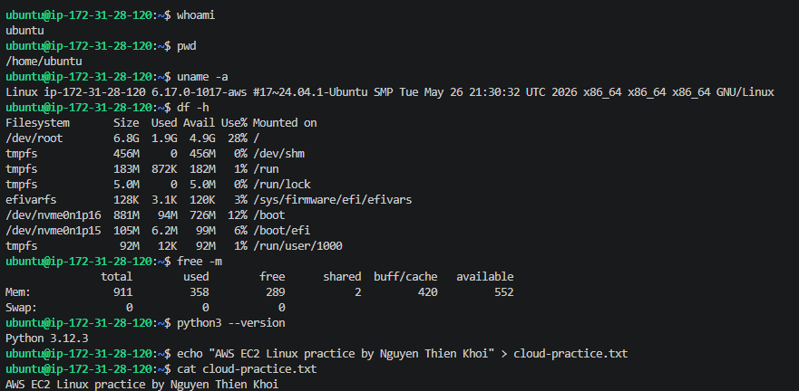
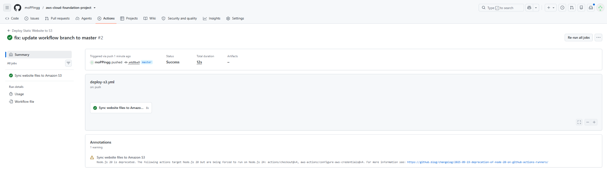

# AWS Cloud Foundation Project

A beginner-friendly AWS hands-on project created to support cloud fundamentals learning and FCJ Workforce preparation. This repository is organized as a set of small labs covering static website hosting, command-line deployment, cost awareness, Linux server practice, and basic monitoring in AWS.

This project is intentionally simple and learning-focused. It does not represent production-level cloud engineering experience. The goal is to build practical familiarity with core services and document the learning process clearly.

## Project Overview

This project is divided into hands-on labs so each AWS topic can be practiced in a focused and manageable way. Together, the labs show a beginner cloud workflow from local development to AWS deployment, monitoring, and cost awareness.

## Current Status

- [x] Completed Lab 01: S3 Static Website Hosting
- [x] Completed Lab 02: AWS CLI Deployment
- [x] Completed Lab 03: AWS Budgets and Cost Monitoring
- [x] Completed Lab 04: EC2 Linux Practice
- [x] Completed Lab 05: CloudWatch Basic Monitoring
- [x] Configured GitHub Actions workflow for automated S3 deployment

## Architecture Overview

```text
Developer Laptop -> AWS CLI -> Amazon S3 -> User Browser
Developer Laptop -> SSH -> EC2 Ubuntu Instance -> CloudWatch CPU Alarm
AWS Account -> AWS Budgets -> Email Alert
```

## Repository Structure

```text
aws-cloud-foundation-lab/
|-- README.md
|-- website/
|   |-- index.html
|   `-- style.css
|-- docs/
|   |-- architecture.md
|   `-- cost-control-checklist.md
|-- scripts/
|   `-- deploy-s3.md
`-- screenshots/
```

## Lab 01: S3 Static Website Hosting

This lab introduces static website hosting with Amazon S3. The focus is on publishing a simple HTML and CSS website from a storage bucket and understanding how S3 can be used for basic web delivery.

- Preparing a bucket for static website hosting
- Uploading website files
- Reviewing public access settings carefully for learning use
- Checking the site in a browser

## Lab 02: AWS CLI Deployment

This lab focuses on deploying website files with the AWS CLI from a local machine. It helps build confidence with command-line workflow and repeatable updates to S3-hosted content.

- Checking AWS CLI installation
- Configuring credentials locally
- Verifying the active AWS identity
- Syncing website files to an S3 bucket



## Lab 03: AWS Budgets and Cost Monitoring

This lab introduces AWS Budgets as a beginner tool for cost awareness. The goal is to create simple spending alerts and build responsible habits while learning in AWS.

- Creating a monthly budget
- Setting an early email alert
- Watching for unexpected usage
- Reviewing cloud cost as part of the lab workflow

## Lab 04: EC2 Linux Practice

This lab is focused on beginner Linux practice using an EC2 instance. It helps with understanding remote access, basic server operations, and command-line familiarity in a cloud environment.
The Lab 04 screenshot is intended to show a successful EC2 terminal session, including the `ubuntu` user, working directory, AWS kernel details, and the output from `cloud-practice.txt`.

- Launching a Linux-based EC2 instance
- Connecting through SSH
- Practicing basic Linux navigation and commands
- Stopping or terminating the instance after use



## Lab 05: CloudWatch Basic Monitoring

This lab introduces simple monitoring concepts using Amazon CloudWatch. It is meant to build awareness of metrics, alarms, and basic operational visibility.

- Viewing EC2 metrics
- Creating a simple CPU alarm
- Understanding alerting basics
- Connecting monitoring to responsible cloud operations

## Lab 06: GitHub Actions S3 Deployment

This lab adds a simple CI/CD workflow using GitHub Actions. When changes are pushed to the repository, GitHub Actions automatically syncs the website files to the Amazon S3 bucket.

This helps practice a basic automated deployment workflow while keeping AWS credentials stored securely in GitHub repository secrets.

### Lab 06: GitHub Actions S3 Deployment



## Tools and AWS Services Used

Tools:

- HTML
- CSS
- AWS CLI
- SSH
- Local text editor or IDE

AWS services:

- Amazon S3
- Amazon EC2
- Amazon CloudWatch
- AWS Budgets
- AWS Identity and Access Management (IAM)

## Cost Control Checklist

- Use the AWS Free Tier where possible
- Set up an AWS Budget with an early alert threshold
- Terminate or stop EC2 instances after lab practice
- Keep only the files needed in S3
- Review active resources after each lab
- Avoid creating extra services that are not required for learning

## Security Notes

This is a personal learning project, but basic security habits still matter.

- Do not commit AWS access keys or secret keys to GitHub
- Use least-privilege IAM permissions where possible
- Do not place sensitive data in a public S3 bucket
- Limit SSH exposure to trusted access when possible
- Clean up unused resources and credentials after testing


## Learning Outcomes

This project helps build beginner-level understanding of:

- Static website hosting on AWS
- Basic CLI-based deployment workflow
- Cost awareness and budget monitoring
- Linux server access through EC2
- Monitoring concepts with CloudWatch
- Writing technical notes and documentation for a learning portfolio

## Next Steps

Possible next steps after this foundation project:

- IAM policy and permission design basics
- Deeper CloudWatch metrics and logs exploration
- Amazon RDS introduction
- Simple API deployment on AWS
- Beginner data pipeline practice
