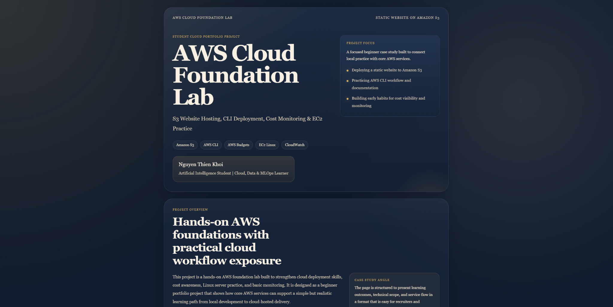
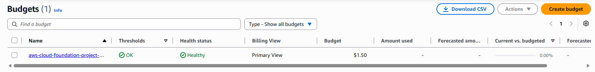
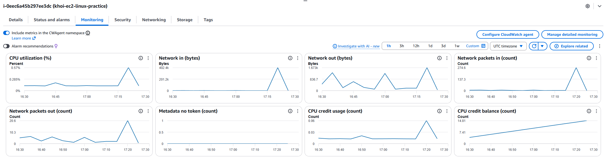

# AWS Cloud Foundation Project

## Project Overview

This is a beginner AWS hands-on project built to practice core cloud skills in a simple and honest way. The project covers S3 static website hosting, AWS CLI deployment, cost monitoring with AWS Budgets, EC2 Linux practice, basic CloudWatch monitoring, and GitHub Actions deployment.

The goal is to build practical familiarity with AWS services and document the learning process clearly. This project is learning-focused and does not claim production-level cloud engineering experience.

Live Demo: http://khoi-aws-cloud-foundation-project-2026.s3-website-ap-southeast-2.amazonaws.com

This demo uses an Amazon S3 static website endpoint for learning purposes.

## Architecture Overview

```text
Developer Laptop -> GitHub Repository -> GitHub Actions -> Amazon S3 Static Website -> User Browser
Developer Laptop -> AWS CLI -> Amazon S3 Bucket
Developer Laptop -> SSH -> EC2 Ubuntu Instance -> CloudWatch Metrics
AWS Account -> AWS Budgets -> Email Alert
```

## Current Status

- [x] Created local static website with HTML/CSS
- [x] Hosted website using Amazon S3
- [x] Deployed website using AWS CLI
- [x] Created AWS Budget and billing alert
- [x] Launched EC2 Ubuntu instance
- [x] Connected to EC2 through SSH
- [x] Reviewed basic CloudWatch monitoring metrics
- [x] Configured GitHub Actions workflow for automated S3 deployment
- [x] Replaced broad S3 permissions with a least-privilege IAM policy
- [x] Added final screenshots and documentation

## Repository Structure

```text
aws-cloud-foundation-lab/
|-- README.md
|-- .gitignore
|-- .github/
|   `-- workflows/
|       `-- deploy-s3.yml
|-- website/
|   |-- index.html
|   `-- style.css
|-- docs/
|   `-- cost-control-checklist.md
|-- scripts/
|   `-- deploy-s3.md
`-- screenshots/
```

## Lab 01: S3 Static Website Hosting

This lab focuses on publishing a simple static website with Amazon S3 and understanding the basics of bucket-based web hosting.

- Create a simple website with HTML and CSS
- Configure an S3 bucket for static website hosting
- Upload website files to the bucket
- Review public access settings carefully for learning use

## Lab 02: AWS CLI Deployment

This lab practices deploying website files from a local machine to Amazon S3 with the AWS CLI.

- Check AWS CLI installation
- Configure local AWS credentials
- Verify the active AWS identity
- Sync the `website/` folder to the S3 bucket

## Lab 03: AWS Budgets and Cost Monitoring

This lab focuses on cost awareness by creating a simple AWS Budget and email alert.

- Create a monthly AWS Budget
- Set an early billing alert
- Review estimated cost during the learning process
- Build better habits around cloud cost monitoring

## Lab 04: EC2 Linux Practice

This lab focuses on beginner Linux practice on an EC2 Ubuntu instance and basic remote access through SSH.

- Launch a Linux-based EC2 instance
- Connect to the instance through SSH
- Practice basic Linux navigation and commands
- Stop or terminate the instance after use

The screenshot shows a successful EC2 terminal session with the `ubuntu` user, `/home/ubuntu`, an AWS kernel from `uname -a`, and the `cloud-practice.txt` output.

## Lab 05: CloudWatch Basic Monitoring

This lab focuses on reviewing basic EC2 monitoring data in Amazon CloudWatch.

- Open CloudWatch from the EC2 workflow
- Review basic EC2 metrics in CloudWatch
- Observe usage trends such as CPU activity
- Connect monitoring review to responsible cloud operations

## Lab 06: GitHub Actions S3 Deployment

This lab adds a simple CI/CD workflow using GitHub Actions. When changes are pushed to the repository, GitHub Actions automatically syncs the website files to the Amazon S3 bucket. AWS credentials are stored in GitHub repository secrets.

### Least-Privilege IAM Improvement

As a beginner security improvement, the deployment IAM user was updated from broader S3 access to a custom least-privilege policy named `S3DeployOnly-khoi-cloud-foundation-project`.

This policy limits deployment access to only the minimum S3 permissions needed to upload, update, and manage website files in the project bucket `khoi-aws-cloud-foundation-project-2026`. GitHub Actions still deploys successfully after switching to this more limited policy.

## Tools and AWS Services Used

- Amazon S3
- AWS CLI
- AWS Budgets
- Amazon EC2
- Amazon CloudWatch
- GitHub Actions
- IAM
- Ubuntu Linux
- SSH
- HTML/CSS
- GitHub

## Cost Control Checklist

- Use the AWS Free Tier where possible
- Set up a budget and billing alert early
- Stop or terminate the EC2 instance after practice
- Keep S3 content limited to the project website files
- Review active resources after each lab

## Security Notes

- No AWS access keys are stored in GitHub
- No `.pem` files are stored in GitHub
- GitHub Secrets are used for CI/CD credentials
- Replaced broad S3 permissions with a least-privilege IAM policy limited to the project bucket
- The public S3 bucket only contains static website files
- The EC2 instance should be terminated after practice

## Screenshots

### Lab 01: S3 Static Website Hosting


### Lab 02: AWS CLI Deployment


### Lab 03: AWS Budgets and Cost Monitoring


### Lab 04: EC2 Linux Practice


### Lab 05: CloudWatch Basic Monitoring


### Lab 06: GitHub Actions S3 Deployment


## Learning Outcomes

This project helped me build beginner-level confidence with core AWS workflows. I practiced how to host and update a static website, monitor basic cloud cost, connect to an EC2 Linux instance through SSH, review CloudWatch metrics, and use GitHub Actions for simple automated deployment.

It also helped me improve documentation habits by recording each lab clearly with screenshots and short explanations.

- Practiced the principle of least privilege in IAM by limiting deployment permissions to one S3 bucket.

## Next Steps

- Review and refine IAM permissions as the project grows
- CloudFront CDN for static website delivery
- Better CloudWatch alarm setup
- Simple serverless visitor counter with Lambda, API Gateway, and DynamoDB
